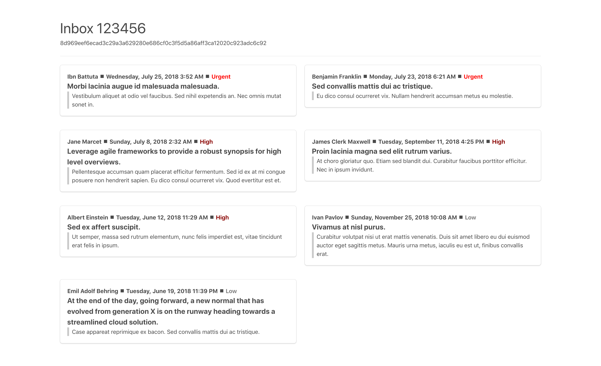

# Frontend Coding Assignment v1

The goal of this coding assignment is ...

- to show your coding style in your preferred frontend technology stack
- to provide materials for further discussion during a live interview
- to write code, of course!

We have formulated _the task_ to take approximately 1 hour given that you familar with your technology stack.

This is _not_ a coding puzzle and there are _no_ tricks.

## Frontend technology and tools

- use one of these popular frontend technologies
  - [React](https://reactjs.org/)
  - [Angular](https://angular.io/)
  - [Vue](https://vuejs.org/)
- use frameworks and libraries if needed that represent best practice and industry standards
- write code to achieve _the task_ below using best practice, industry standards and _your professional experience_

## The task

## The task

1. Given a RESTful API endpoint that returns data encoded in a JWT-like structure based on a six-digit numeric string:
   > https://coding-assignment-v1.now.sh/api/v1/inbox/{id}
2. Fetch the payload
3. Decode the payload
4. Provide the user the capability to enter an `{id}` via a form and _request the inbox_
5. Display...
   1. the _inbox alias_ and _inbox id_
   2. for each message
      - the _message sender_
      - the _message sent at_ formatted for human readability
      - the _message subject_ and _message content_
      - the _message priority_ as
        Urgent, High, Medium, or Low

Here is an example visual guide you may draw inspiration from.

### Submisson

Please submit the following...

1. your source code
2. an screenshot example of your frontend display
3. any documents (READMEs, notes, etc) that support your project

You may submit this by...

- creating a public git repository for your project and sending the link
  - **or**
- creating a zip file of your project and sending the file via email

## FAQ

There is a general [FAQ available](../faq.md).

#### Does my submission have to look like the example?

No. This example uses a simple [CSS utility framework](https://bulma.io/).

Your submission should meet the display criteria. Your look and feel can be minimal or as advanced as you like. This is _not_ a design assignment, however, your submission should look reasonable.
